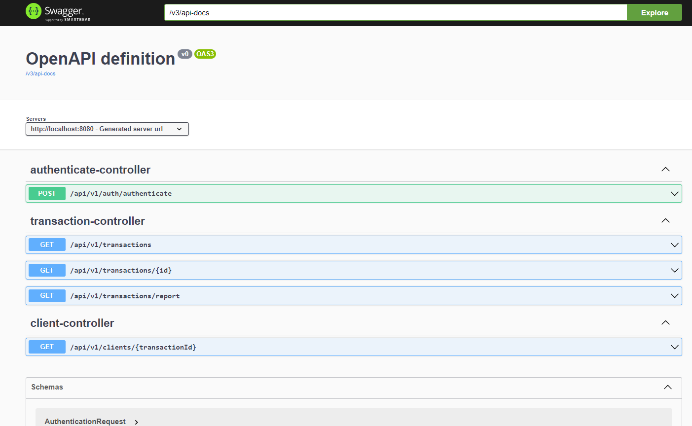

# Reporting API Project #


## What is this repository for? ##

* The Reporting API is a project developed using Spring Boot that allows you to manage and collect payment information through APIs. With this project, you can easily collect payment information through RESTful APIs.
  

## Prerequisites ##
* Java 17
* Maven 3 or above
* Spring Boot 3


## Building Project ##

* On the terminal run the below command to build project.
  
``` mvn clean install ```

## Running Project ##
* To start the application on localhost:8080, run the command below on the terminal.

``` mvn spring-boot:run ```

## Running Tests ##
* To run test by using below command
``` 
 mvn clean test 
```

## Authentication ##
Reporting API project uses Oauth2 authentication mechanism in order to create JTW token.

Token is created by using /authenticate

The generated token should be sent in the HTTP header with a __Bearer__ prefix for each request.

##Documentation ##
The Reporting API documentation is available  through Swagger.


## Containerization ##

Application environment defined in the Dockerfile. Also docker-compse.yml file helps 
to run application in isolated way.

Running``` docker-compose up -d``` starts the container in the background and leave running.

## Endpoints ###

| Command |HTTP Method| Endpoint |
| --- | --- | --- |
| create | POST  | localhost:8080/api/v1/auth/authenticate
| retrieve | GET |localhost:8080/api/v1/transactions/{transactionId} |
| list | GET  | localhost:8080/api/v1/transactions
| list | GET  | localhost:8080/api/v1/transactions/report
| retrieve | GET  | localhost:8080/api/v1/clients/{transactionId}
